# PRAKTIKUM 12

## Framework Lanjutan (CRUD)

1. Membuat Database

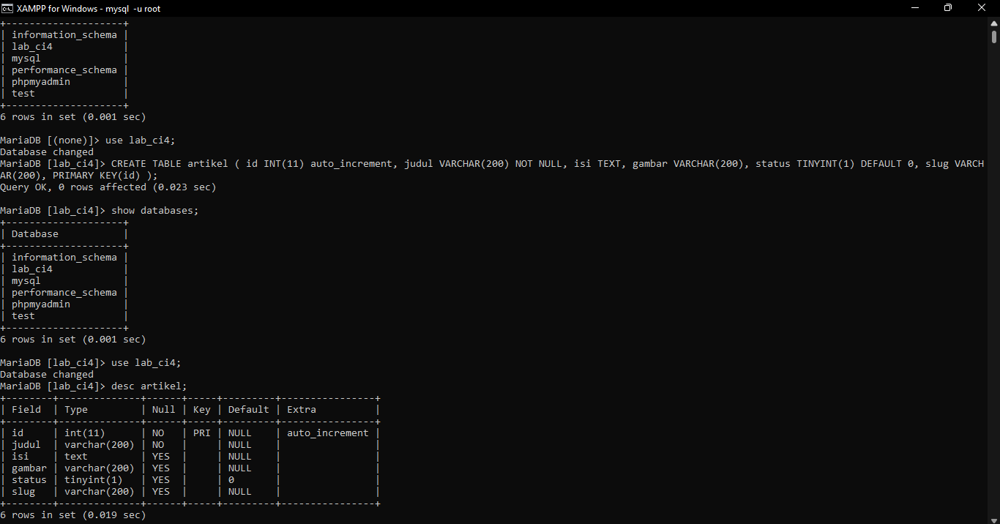

Konfigurasi koneksi database
Selanjutnya membuat konfigurasi untuk menghubungkan dengan database server.
Konfigurasi dapat dilakukan dengan du acara, yaitu pada file app/config/database.php
atau menggunakan file .env. Pada praktikum ini kita gunakan konfigurasi pada file .env.

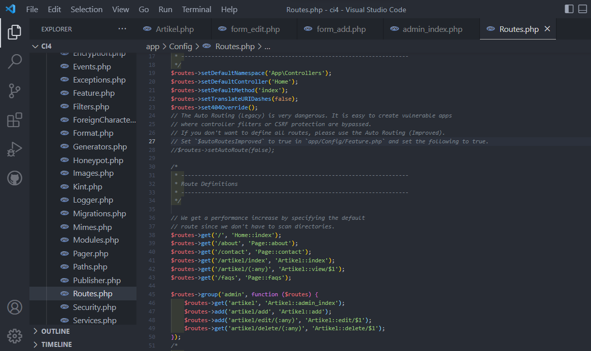

2. Membuat Model
Selanjutnya adalah membuat Model untuk memproses data Artikel. Buat file baru pada
direktori app/Models dengan nama ArtikelModel.php

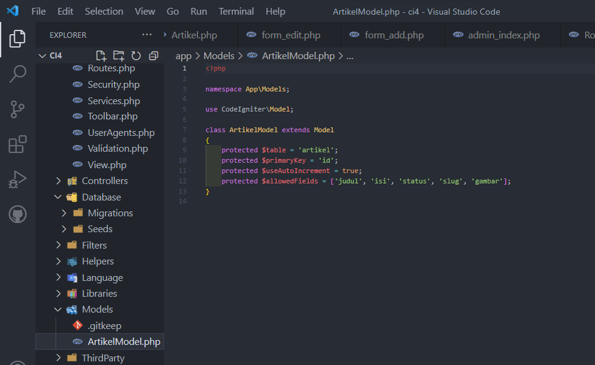

3. Membuat Controller
Buat Controller baru dengan nama Artikel.php pada direktori app/Controllers.

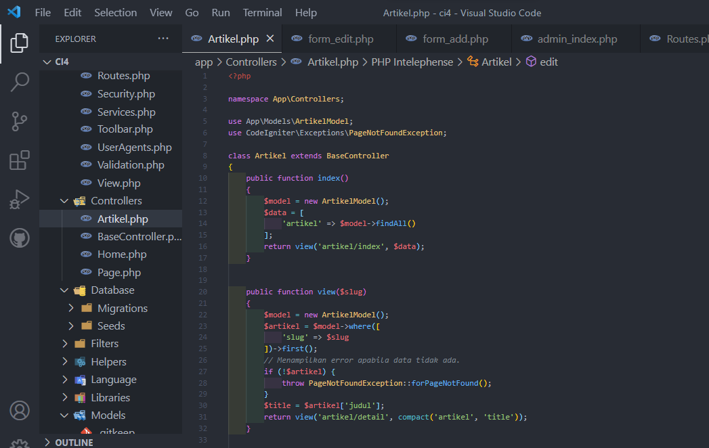

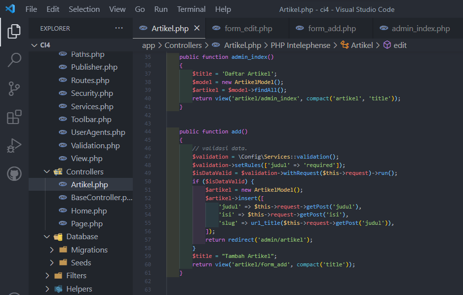

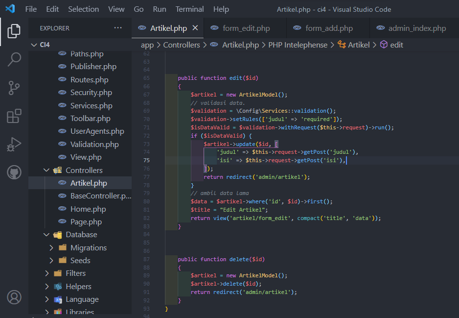

4. Membuat View
Buat direktori baru dengan nama artikel pada direktori app/views, kemudian buat file
baru dengan nama index.php.

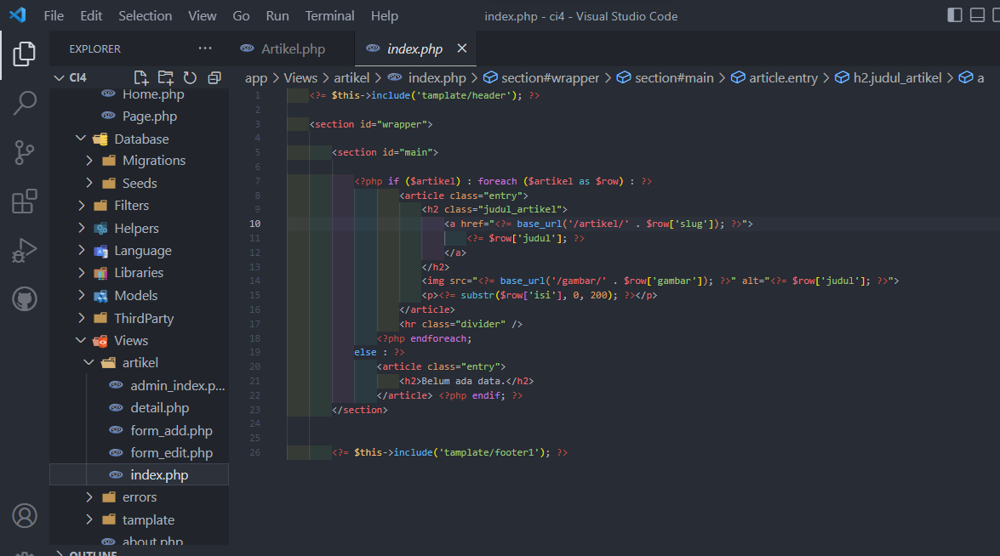

Selanjutnya buka browser kembali, dengan mengakses url http://localhost:8080/artikel

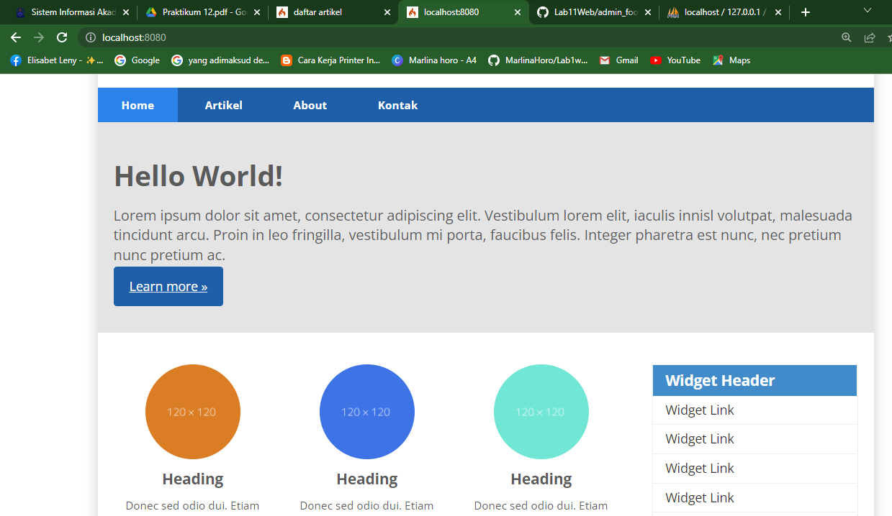

8. Belum ada data yang diampilkan. Kemudian coba tambahkan beberapa data pada
database agar dapat ditampilkan datanya.
menggunakan cmd

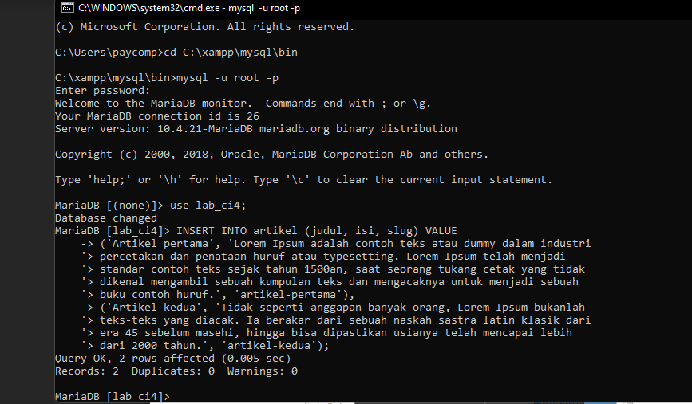

9. Membuat View Detail
Buat view baru untuk halaman detail dengan nama app/views/artikel/detail.php.

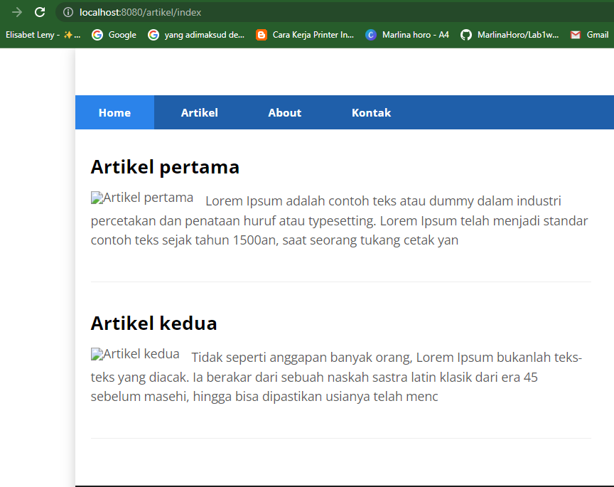

10. Membuat Menu Admin
Menu admin adalah untuk proses CRUD data artikel. Buat method baru pada
Controller Artikel dengan nama admin_index().

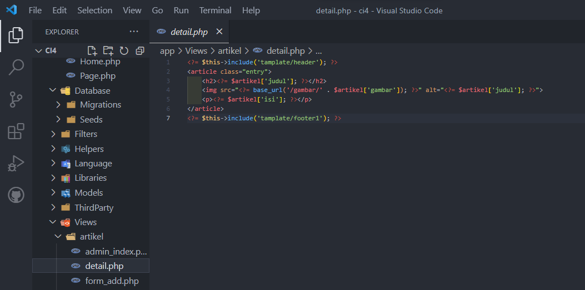

Akses menu admin dengan url http://localhost:8080/admin/artikel

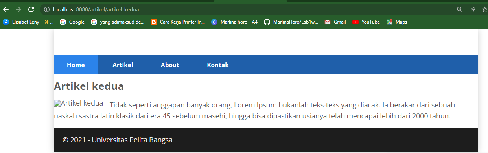

Kemudian buat view untuk form tambah dengan nama form_add.php

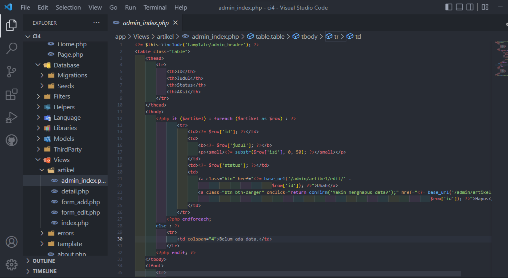

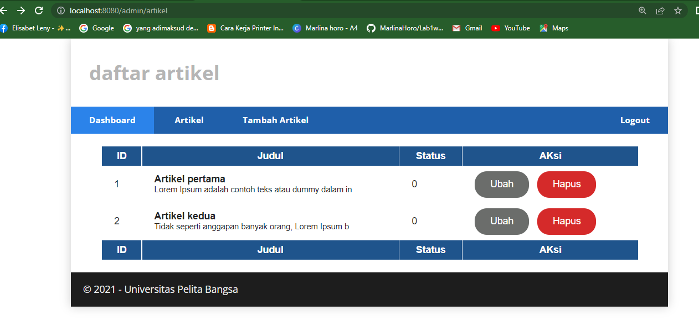

11. Mengubah Data
Tambahkan fungsi/method baru pada Controller Artikel dengan nama edit().

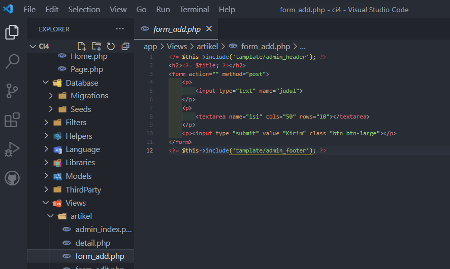

12. Menghapus Data
Tambahkan fungsi/method baru pada Controller Artikel dengan nama delete().

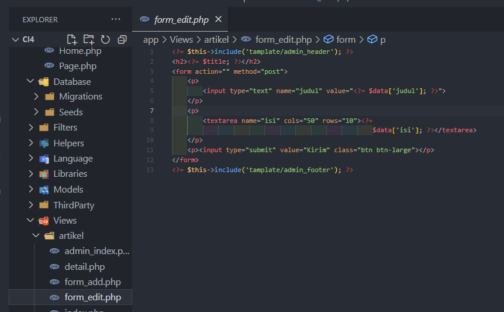

