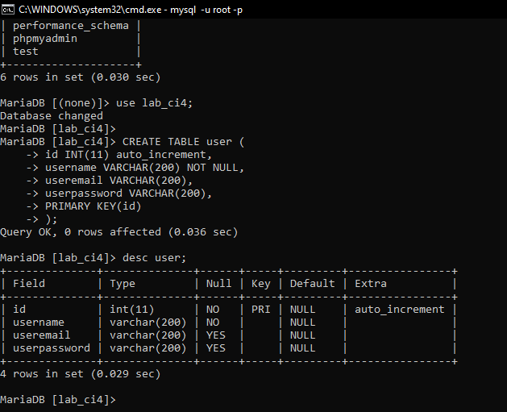

## PRAKTIKUM 13
 ## Langkah-langkah Praktikum
Persiapan.
Untuk memulai membuat modul Login, yang perlu disiapkan adalah database server menggunakan MySQL. Pastikan MySQL Server sudah dapat dijalankan melalui XAMPP.
1. Membuat Tabel: User Login

