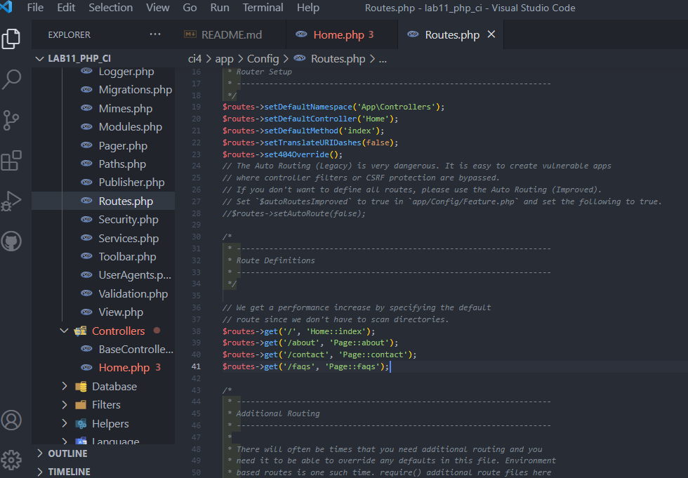
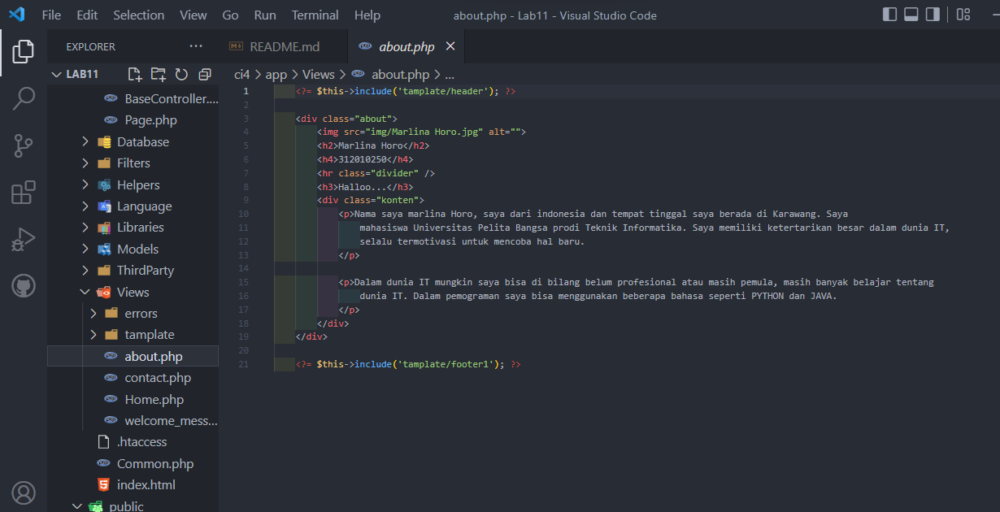
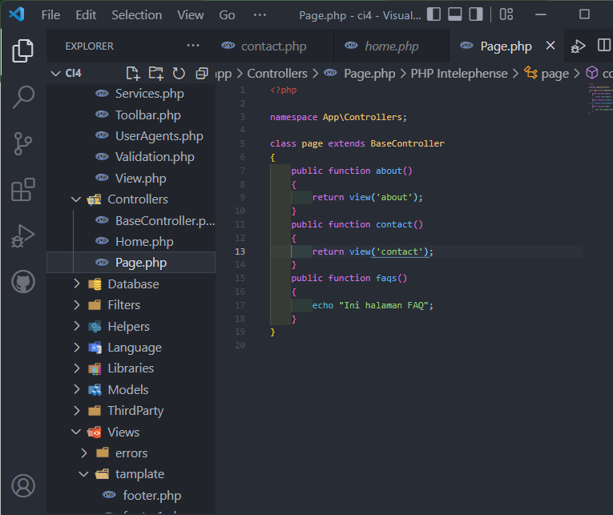
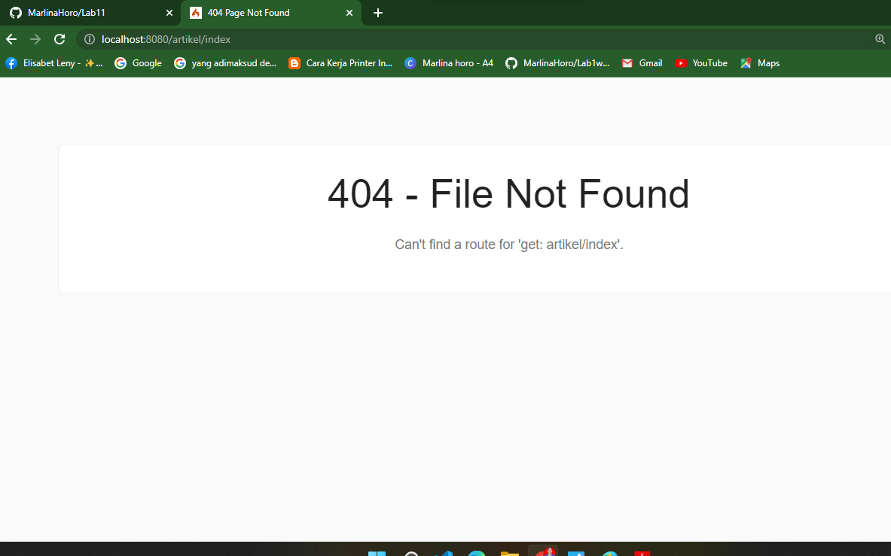
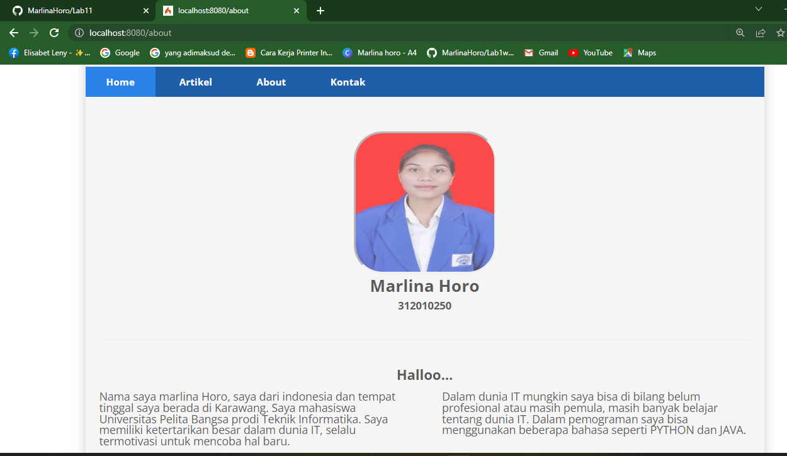
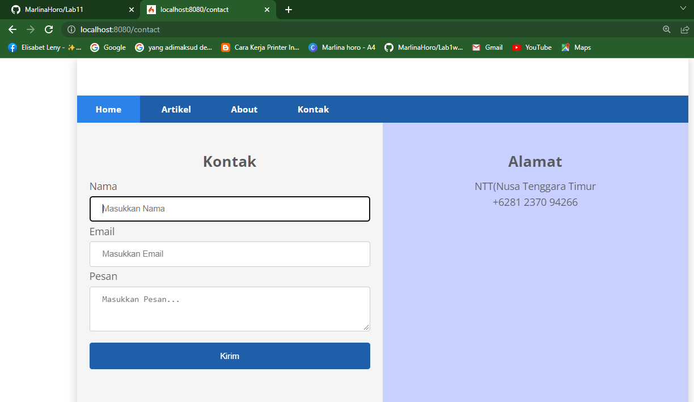

## Nama     : Marlina Horo
## Nim      : 312010250
## kelas    : Ti 20 A2

Sebelum memulai menggunakan Framework Codeigniter, perlu dilakukan konfigurasi pada webserver. Beberapa ekstensi PHP perlu diaktifkan untuk kebutuhan pengembangan Codeigniter 4. Berikut beberapa ekstensi yang perlu diaktifkan: • php-json ekstension untuk bekerja dengan JSON; • php-mysqlnd native driver untuk MySQL; • php-xml ekstension untuk bekerja dengan XML; • php-intl ekstensi untuk membuat aplikasi multibahasa; • libcurl (opsional), jika ingin pakai Curl.

## 1. Mengaktifkan ekstentsi tersebut, melalu XAMPP Control Panel, pada bagian Apache klik Config -> PHP.ini

Pada bagian extention, hilangkan tanda ; (titik koma) pada ekstensi yang akan diaktifkan. Kemudian simpan kembali filenya dan restart Apache web server.

## 2. Instalasi Codeigniter 4

Untuk melakukan instalasi Codeigniter 4 dapat dilakukan dengan dua cara, yaitu cara manual dan menggunakan composer. Pada praktikum ini kita menggunakan cara manual.

aktifkan bebarapa exetension seperti diatas.`

## 3. kemudia membuat file baru dengan nama lab11_php_ci

## 4. INSTALISASI CODINGITER 4

Untuk melakukan instalasi codeigniter 4 dapat dilakukan dengan dua cara , yaitu cara manual dan menggunakan composer. pada praktikum ini kita menggunakan cara manual.

Unduh Codeigniter dari website https://codeigniter.com/download Extrak file zip Codeigniter ke directori htdocs/lab11_ci. Ubah nama direktory framework-4.x.xx menjadi ci4 Buka browser dengan alamat
https://http://localhost/lab11_php_ci/ci4/public/

container telah berhasil didonwload

## 5.MENJALANKAN CLI (Command Line Interface)

Codeigniter 4 menyediakan CLI untuk mempermudah proses development. Untuk mengakses CLI buka terminal/command prompt.

Arahkan lokasi direktori sesuai dengan direktori kerja project dibuat (C:\xampp\htdocs\Lab11Web\lab11_php_ci\ci4)

Perintah yang dapat dijalankan untuk memanggil CLI Codeigniter adalah

php spark berhasil dipanggil

## 6. MENGAKTIFKAN MODE DEBUGGING

Codeigniter 4 menyediakan fitur debugging untuk memudahkan developer untuk mengetahui pesan erorr apabila terjadi kesalahan membuat kode program.

Secara default fitur ini belum aktif. Ketika terjadi erorr pada aplikasi akan ditampilkan pesan seperti berikut

Semua jenis erorr akan ditampilkan sama. Untuk memudahkan mengetahui jenis erorrnya, maka perlu diaktifkan mode debugging dengan mengubah nilai konfigurasi pada environment variable CI_ENVIRONMENT menjadi development.

## 7 Ubah nama file env menjadi .env kemudian buka file tersebut dan ubah nilai variable CI``_ENVIRONMENT menjadi development.

contoh erorr yang terjadi. Untuk mencoba erorr tersebut, ubah kode pada file app/Controller/Home.php hilangkan titik koma pada akhir kode.

## 8. Membuat rute Baru

Tambahkan kode berikut di dalam Routes.php

## 9. Buat file baru dengan nama about.php pada direktori view (app/view/about.php)

Ubah method about pada class Controller Page

halaman about

## 10. membuat file baru dengan contact.php

halaman contact 

