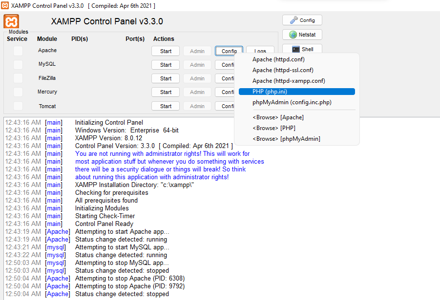
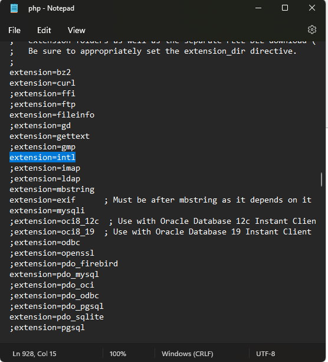
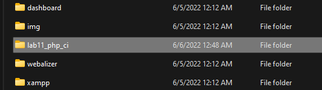
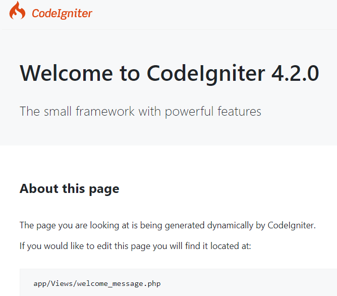
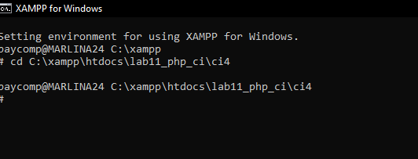
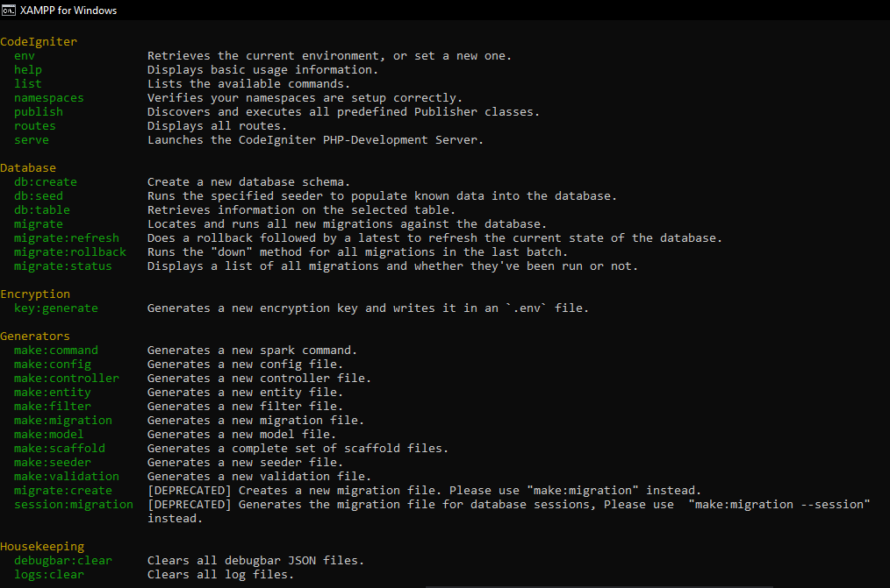
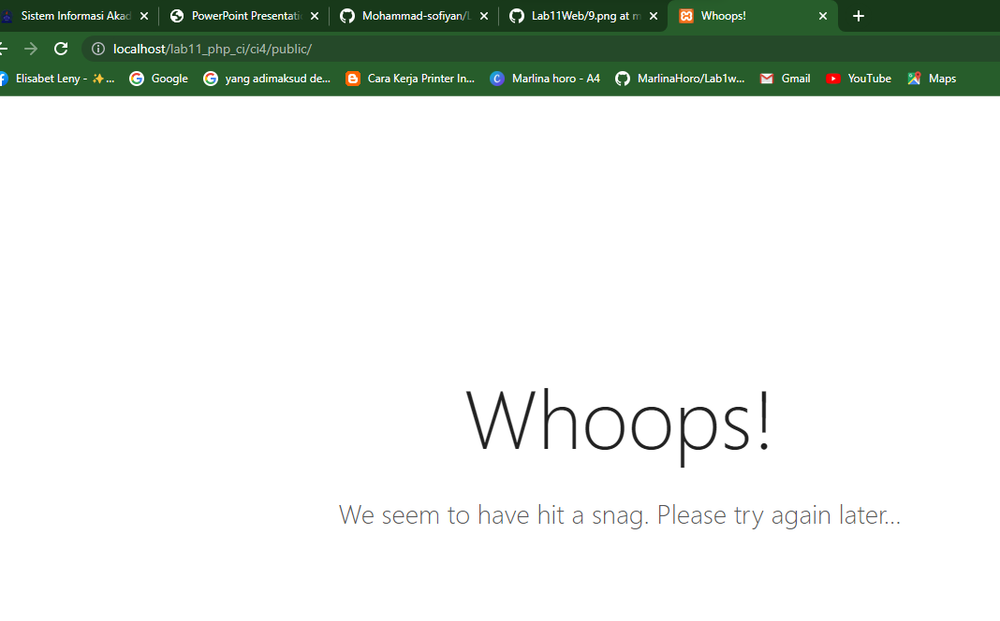
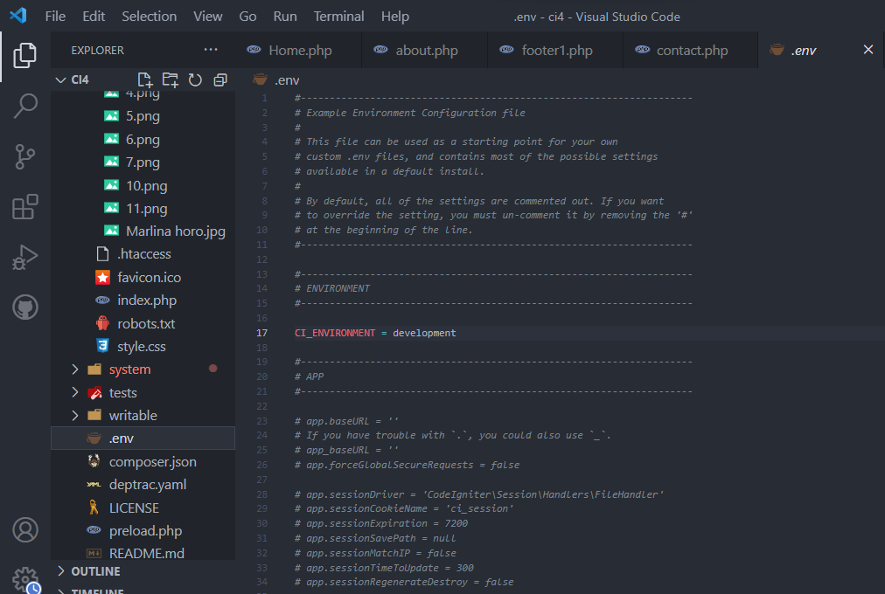
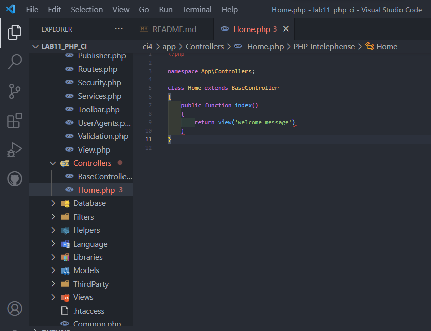
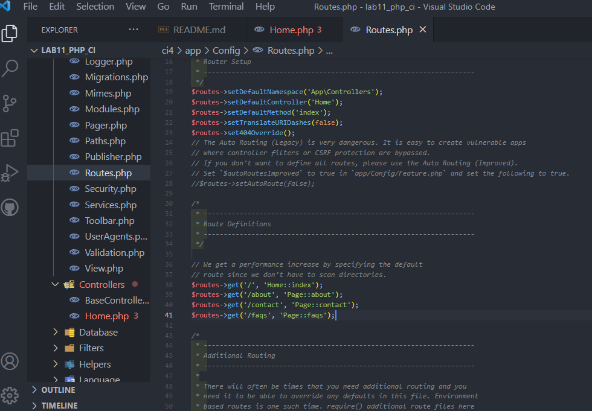

# CodeIgniter 4 Development

 

## What is CodeIgniter?

CodeIgniter is a PHP full-stack web framework that is light, fast, flexible and secure.
More information can be found at the [official site](http://codeigniter.com).

This repository holds the source code for CodeIgniter 4 only.
Version 4 is a complete rewrite to bring the quality and the code into a more modern version,
while still keeping as many of the things intact that has made people love the framework over the years.

More information about the plans for version 4 can be found in [the announcement](http://forum.codeigniter.com/thread-62615.html) on the forums.

### Documentation

The [User Guide](https://codeigniter4.github.io/userguide/) is the primary documentation for CodeIgniter 4.

The current **in-progress** User Guide can be found [here](https://codeigniter4.github.io/CodeIgniter4/).
As with the rest of the framework, it is a work in progress, and will see changes over time to structure, explanations, etc.

You might also be interested in the [API documentation](https://codeigniter4.github.io/api/) for the framework components.

## Important Change with index.php

index.php is no longer in the root of the project! It has been moved inside the *public* folder,
for better security and separation of components.

This means that you should configure your web server to "point" to your project's *public* folder, and
not to the project root. A better practice would be to configure a virtual host to point there. A poor practice would be to point your web server to the project root and expect to enter *public/...*, as the rest of your logic and the
framework are exposed.

**Please** read the user guide for a better explanation of how CI4 works!

## Repository Management

CodeIgniter is developed completely on a volunteer basis. As such, please give up to 7 days
for your issues to be reviewed. If you haven't heard from one of the team in that time period,
feel free to leave a comment on the issue so that it gets brought back to our attention.

We use GitHub issues to track **BUGS** and to track approved **DEVELOPMENT** work packages.
We use our [forum](http://forum.codeigniter.com) to provide SUPPORT and to discuss
FEATURE REQUESTS.

If you raise an issue here that pertains to support or a feature request, it will
be closed! If you are not sure if you have found a bug, raise a thread on the forum first -
someone else may have encountered the same thing.

Before raising a new GitHub issue, please check that your bug hasn't already
been reported or fixed.

We use pull requests (PRs) for CONTRIBUTIONS to the repository.
We are looking for contributions that address one of the reported bugs or
approved work packages.

Do not use a PR as a form of feature request.
Unsolicited contributions will only be considered if they fit nicely
into the framework roadmap.
Remember that some components that were part of CodeIgniter 3 are being moved
to optional packages, with their own repository.

## Contributing

We **are** accepting contributions from the community! It doesn't matter whether you can code, write documentation, or help find bugs, 
all contributions are welcome. 

Please read the [*Contributing to CodeIgniter*](https://github.com/codeigniter4/CodeIgniter4/blob/develop/contributing/README.md).

CodeIgniter has had thousands on contributions from people since its creation. This project would not be what it is without them. 

Made with [contrib.rocks](https://contrib.rocks).

## Server Requirements

PHP version 7.4 or higher is required, with the following extensions installed:

- [intl](http://php.net/manual/en/intl.requirements.php)
- [libcurl](http://php.net/manual/en/curl.requirements.php) if you plan to use the HTTP\CURLRequest library
- [mbstring](http://php.net/manual/en/mbstring.installation.php)

Additionally, make sure that the following extensions are enabled in your PHP:

- json (enabled by default - don't turn it off)
- xml (enabled by default - don't turn it off)
- [mysqlnd](http://php.net/manual/en/mysqlnd.install.php)

## Running CodeIgniter Tests

Information on running the CodeIgniter test suite can be found in the [README.md](tests/README.md) file in the tests directory.

## Nama     : Marlina Horo
## Nim      : 312010250
## kelas    : Ti 20 A2

Sebelum memulai menggunakan Framework Codeigniter, perlu dilakukan konfigurasi pada webserver. Beberapa ekstensi PHP perlu diaktifkan untuk kebutuhan pengembangan Codeigniter 4. Berikut beberapa ekstensi yang perlu diaktifkan: • php-json ekstension untuk bekerja dengan JSON; • php-mysqlnd native driver untuk MySQL; • php-xml ekstension untuk bekerja dengan XML; • php-intl ekstensi untuk membuat aplikasi multibahasa; • libcurl (opsional), jika ingin pakai Curl.

## 1. Mengaktifkan ekstentsi tersebut, melalu XAMPP Control Panel, pada bagian Apache klik Config -> PHP.ini

Pada bagian extention, hilangkan tanda ; (titik koma) pada ekstensi yang akan diaktifkan. Kemudian simpan kembali filenya dan restart Apache web server.

## 2. Instalasi Codeigniter 4

Untuk melakukan instalasi Codeigniter 4 dapat dilakukan dengan dua cara, yaitu cara manual dan menggunakan composer. Pada praktikum ini kita menggunakan cara manual.

aktifkan bebarapa exetension seperti diatas.`

## 3. kemudia membuat file baru dengan nama lab11_php_ci

## 4. INSTALISASI CODINGITER 4

Untuk melakukan instalasi codeigniter 4 dapat dilakukan dengan dua cara , yaitu cara manual dan menggunakan composer. pada praktikum ini kita menggunakan cara manual.

Unduh Codeigniter dari website https://codeigniter.com/download Extrak file zip Codeigniter ke directori htdocs/lab11_ci. Ubah nama direktory framework-4.x.xx menjadi ci4 Buka browser dengan alamat
https://http://localhost/lab11_php_ci/ci4/public/

container telah berhasil didonwload

## 5.MENJALANKAN CLI (Command Line Interface)

Codeigniter 4 menyediakan CLI untuk mempermudah proses development. Untuk mengakses CLI buka terminal/command prompt.

Arahkan lokasi direktori sesuai dengan direktori kerja project dibuat (C:\xampp\htdocs\Lab11Web\lab11_php_ci\ci4)

Perintah yang dapat dijalankan untuk memanggil CLI Codeigniter adalah

php spark berhasil dipanggil

## 6. MENGAKTIFKAN MODE DEBUGGING

Codeigniter 4 menyediakan fitur debugging untuk memudahkan developer untuk mengetahui pesan erorr apabila terjadi kesalahan membuat kode program.

Secara default fitur ini belum aktif. Ketika terjadi erorr pada aplikasi akan ditampilkan pesan seperti berikut

Semua jenis erorr akan ditampilkan sama. Untuk memudahkan mengetahui jenis erorrnya, maka perlu diaktifkan mode debugging dengan mengubah nilai konfigurasi pada environment variable CI_ENVIRONMENT menjadi development.

## 7 Ubah nama file env menjadi .env kemudian buka file tersebut dan ubah nilai variable CI``_ENVIRONMENT menjadi development.

contoh erorr yang terjadi. Untuk mencoba erorr tersebut, ubah kode pada file app/Controller/Home.php hilangkan titik koma pada akhir kode.

## 8. Membuat rute Baru

Tambahkan kode berikut di dalam Routes.php

